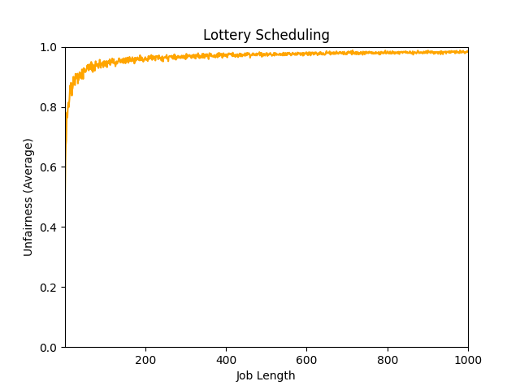
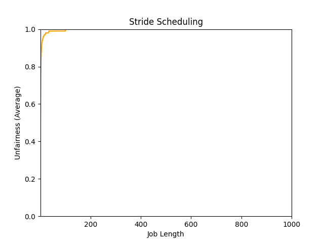

# Chapter 8

1.

```bash
./mlfq.py -s 0 -n 2 -j 2 -m 20 -M 0 -c

Execution Trace:

[ time 0 ] JOB BEGINS by JOB 0
[ time 0 ] JOB BEGINS by JOB 1
[ time 0 ] Run JOB 0 at PRIORITY 1 [ TICKS 9 ALLOT 1 TIME 16 (of 17) ]
[ time 1 ] Run JOB 0 at PRIORITY 1 [ TICKS 8 ALLOT 1 TIME 15 (of 17) ]
[ time 2 ] Run JOB 0 at PRIORITY 1 [ TICKS 7 ALLOT 1 TIME 14 (of 17) ]
[ time 3 ] Run JOB 0 at PRIORITY 1 [ TICKS 6 ALLOT 1 TIME 13 (of 17) ]
[ time 4 ] Run JOB 0 at PRIORITY 1 [ TICKS 5 ALLOT 1 TIME 12 (of 17) ]
[ time 5 ] Run JOB 0 at PRIORITY 1 [ TICKS 4 ALLOT 1 TIME 11 (of 17) ]
[ time 6 ] Run JOB 0 at PRIORITY 1 [ TICKS 3 ALLOT 1 TIME 10 (of 17) ]
[ time 7 ] Run JOB 0 at PRIORITY 1 [ TICKS 2 ALLOT 1 TIME 9 (of 17) ]
[ time 8 ] Run JOB 0 at PRIORITY 1 [ TICKS 1 ALLOT 1 TIME 8 (of 17) ]
[ time 9 ] Run JOB 0 at PRIORITY 1 [ TICKS 0 ALLOT 1 TIME 7 (of 17) ]
[ time 10 ] Run JOB 1 at PRIORITY 1 [ TICKS 9 ALLOT 1 TIME 7 (of 8) ]
[ time 11 ] Run JOB 1 at PRIORITY 1 [ TICKS 8 ALLOT 1 TIME 6 (of 8) ]
[ time 12 ] Run JOB 1 at PRIORITY 1 [ TICKS 7 ALLOT 1 TIME 5 (of 8) ]
[ time 13 ] Run JOB 1 at PRIORITY 1 [ TICKS 6 ALLOT 1 TIME 4 (of 8) ]
[ time 14 ] Run JOB 1 at PRIORITY 1 [ TICKS 5 ALLOT 1 TIME 3 (of 8) ]
[ time 15 ] Run JOB 1 at PRIORITY 1 [ TICKS 4 ALLOT 1 TIME 2 (of 8) ]
[ time 16 ] Run JOB 1 at PRIORITY 1 [ TICKS 3 ALLOT 1 TIME 1 (of 8) ]
[ time 17 ] Run JOB 1 at PRIORITY 1 [ TICKS 2 ALLOT 1 TIME 0 (of 8) ]
[ time 18 ] FINISHED JOB 1
[ time 18 ] Run JOB 0 at PRIORITY 0 [ TICKS 9 ALLOT 1 TIME 6 (of 17) ]
[ time 19 ] Run JOB 0 at PRIORITY 0 [ TICKS 8 ALLOT 1 TIME 5 (of 17) ]
[ time 20 ] Run JOB 0 at PRIORITY 0 [ TICKS 7 ALLOT 1 TIME 4 (of 17) ]
[ time 21 ] Run JOB 0 at PRIORITY 0 [ TICKS 6 ALLOT 1 TIME 3 (of 17) ]
[ time 22 ] Run JOB 0 at PRIORITY 0 [ TICKS 5 ALLOT 1 TIME 2 (of 17) ]
[ time 23 ] Run JOB 0 at PRIORITY 0 [ TICKS 4 ALLOT 1 TIME 1 (of 17) ]
[ time 24 ] Run JOB 0 at PRIORITY 0 [ TICKS 3 ALLOT 1 TIME 0 (of 17) ]
[ time 25 ] FINISHED JOB 0

Final statistics:
  Job  0: startTime   0 - response   0 - turnaround  25
  Job  1: startTime   0 - response  10 - turnaround  18

  Avg  1: startTime n/a - response 5.00 - turnaround 21.50

```

2.

```bash
# 8.2 Long-running Job Over Time
./mlfq.py -n 3 -q 10 -l 0,200,0 -c

# 8.3 Along Came An Interactive Job
./mlfq.py -n 3 -q 10 -l 0,180,0:100,20,0 -c

# 8.4 A Mixed I/O-intensive and CPU-intensive Workload
./mlfq.py -n 3 -q 10 -l 0,175,0:50,25,1 -i 5 -S -c

# Figure 8.5 without priority boost
./mlfq.py -n 3 -q 10 -l 0,120,0:100,50,1:100,50,1 -i 1 -S -c

# Figure 8.5 with priority boost
./mlfq.py -n 3 -q 10 -l 0,120,0:100,50,1:100,50,1 -i 1 -S -B 50 -c

# Figure 8.6 without gaming tolerance
./mlfq.py -n 3 -q 10 -i 1 -S -l 0,200,0:80,100,9 -c

# Figure 8.6 with gaming tolerance
./mlfq.py -n 3 -q 10 -i 1 -l 0,200,0:80,100,9 -c

# Figure 8.7 Lower Priority, Longer Quanta
./mlfq.py -n 3 -a 2 -Q 10,20,40 -l 0,200,0:0,200,0 -c
```

3.

Make time allotment shorter than job run time for each queue.

4.

```bash
./mlfq.py -n 3 -q 10 -l 0,50,0:0,50,9 -i 1 -S -c
```

5.

10ms / 5% = 200ms

6.

Turn this flag on might cause CPU-intensive jobs to wait more time for I/O jobs, thus increasing the whole average turnaround time.

# Chapter 9

1.

```bash
./lottery.py -s 1 -j 3 -c

** Solutions **

Random 651593 -> Winning ticket 119 (of 153) -> Run 2
  Jobs:
 (  job:0 timeleft:1 tix:84 )  (  job:1 timeleft:7 tix:25 )  (* job:2 timeleft:4 tix:44 )
Random 788724 -> Winning ticket 9 (of 153) -> Run 0
  Jobs:
 (* job:0 timeleft:1 tix:84 )  (  job:1 timeleft:7 tix:25 )  (  job:2 timeleft:3 tix:44 )
--> JOB 0 DONE at time 2
Random 93859 -> Winning ticket 19 (of 69) -> Run 1
  Jobs:
 (  job:0 timeleft:0 tix:--- )  (* job:1 timeleft:7 tix:25 )  (  job:2 timeleft:3 tix:44 )
Random 28347 -> Winning ticket 57 (of 69) -> Run 2
  Jobs:
 (  job:0 timeleft:0 tix:--- )  (  job:1 timeleft:6 tix:25 )  (* job:2 timeleft:3 tix:44 )
Random 835765 -> Winning ticket 37 (of 69) -> Run 2
  Jobs:
 (  job:0 timeleft:0 tix:--- )  (  job:1 timeleft:6 tix:25 )  (* job:2 timeleft:2 tix:44 )
Random 432767 -> Winning ticket 68 (of 69) -> Run 2
  Jobs:
 (  job:0 timeleft:0 tix:--- )  (  job:1 timeleft:6 tix:25 )  (* job:2 timeleft:1 tix:44 )
--> JOB 2 DONE at time 6
Random 762280 -> Winning ticket 5 (of 25) -> Run 1
  Jobs:
 (  job:0 timeleft:0 tix:--- )  (* job:1 timeleft:6 tix:25 )  (  job:2 timeleft:0 tix:--- )
Random 2106 -> Winning ticket 6 (of 25) -> Run 1
  Jobs:
 (  job:0 timeleft:0 tix:--- )  (* job:1 timeleft:5 tix:25 )  (  job:2 timeleft:0 tix:--- )
Random 445387 -> Winning ticket 12 (of 25) -> Run 1
  Jobs:
 (  job:0 timeleft:0 tix:--- )  (* job:1 timeleft:4 tix:25 )  (  job:2 timeleft:0 tix:--- )
Random 721540 -> Winning ticket 15 (of 25) -> Run 1
  Jobs:
 (  job:0 timeleft:0 tix:--- )  (* job:1 timeleft:3 tix:25 )  (  job:2 timeleft:0 tix:--- )
Random 228762 -> Winning ticket 12 (of 25) -> Run 1
  Jobs:
 (  job:0 timeleft:0 tix:--- )  (* job:1 timeleft:2 tix:25 )  (  job:2 timeleft:0 tix:--- )
Random 945271 -> Winning ticket 21 (of 25) -> Run 1
  Jobs:
 (  job:0 timeleft:0 tix:--- )  (* job:1 timeleft:1 tix:25 )  (  job:2 timeleft:0 tix:--- )
--> JOB 1 DONE at time 12

./lottery.py -s 2 -j 3 -c

** Solutions **

Random 605944 -> Winning ticket 169 (of 197) -> Run 2
  Jobs:
 (  job:0 timeleft:9 tix:94 )  (  job:1 timeleft:8 tix:73 )  (* job:2 timeleft:6 tix:30 )
Random 606802 -> Winning ticket 42 (of 197) -> Run 0
  Jobs:
 (* job:0 timeleft:9 tix:94 )  (  job:1 timeleft:8 tix:73 )  (  job:2 timeleft:5 tix:30 )
Random 581204 -> Winning ticket 54 (of 197) -> Run 0
  Jobs:
 (* job:0 timeleft:8 tix:94 )  (  job:1 timeleft:8 tix:73 )  (  job:2 timeleft:5 tix:30 )
Random 158383 -> Winning ticket 192 (of 197) -> Run 2
  Jobs:
 (  job:0 timeleft:7 tix:94 )  (  job:1 timeleft:8 tix:73 )  (* job:2 timeleft:5 tix:30 )
Random 430670 -> Winning ticket 28 (of 197) -> Run 0
  Jobs:
 (* job:0 timeleft:7 tix:94 )  (  job:1 timeleft:8 tix:73 )  (  job:2 timeleft:4 tix:30 )
Random 393532 -> Winning ticket 123 (of 197) -> Run 1
  Jobs:
 (  job:0 timeleft:6 tix:94 )  (* job:1 timeleft:8 tix:73 )  (  job:2 timeleft:4 tix:30 )
Random 723012 -> Winning ticket 22 (of 197) -> Run 0
  Jobs:
 (* job:0 timeleft:6 tix:94 )  (  job:1 timeleft:7 tix:73 )  (  job:2 timeleft:4 tix:30 )
Random 994820 -> Winning ticket 167 (of 197) -> Run 2
  Jobs:
 (  job:0 timeleft:5 tix:94 )  (  job:1 timeleft:7 tix:73 )  (* job:2 timeleft:4 tix:30 )
Random 949396 -> Winning ticket 53 (of 197) -> Run 0
  Jobs:
 (* job:0 timeleft:5 tix:94 )  (  job:1 timeleft:7 tix:73 )  (  job:2 timeleft:3 tix:30 )
Random 544177 -> Winning ticket 63 (of 197) -> Run 0
  Jobs:
 (* job:0 timeleft:4 tix:94 )  (  job:1 timeleft:7 tix:73 )  (  job:2 timeleft:3 tix:30 )
Random 444854 -> Winning ticket 28 (of 197) -> Run 0
  Jobs:
 (* job:0 timeleft:3 tix:94 )  (  job:1 timeleft:7 tix:73 )  (  job:2 timeleft:3 tix:30 )
Random 268241 -> Winning ticket 124 (of 197) -> Run 1
  Jobs:
 (  job:0 timeleft:2 tix:94 )  (* job:1 timeleft:7 tix:73 )  (  job:2 timeleft:3 tix:30 )
Random 35924 -> Winning ticket 70 (of 197) -> Run 0
  Jobs:
 (* job:0 timeleft:2 tix:94 )  (  job:1 timeleft:6 tix:73 )  (  job:2 timeleft:3 tix:30 )
Random 27444 -> Winning ticket 61 (of 197) -> Run 0
  Jobs:
 (* job:0 timeleft:1 tix:94 )  (  job:1 timeleft:6 tix:73 )  (  job:2 timeleft:3 tix:30 )
--> JOB 0 DONE at time 14
Random 464894 -> Winning ticket 55 (of 103) -> Run 1
  Jobs:
 (  job:0 timeleft:0 tix:--- )  (* job:1 timeleft:6 tix:73 )  (  job:2 timeleft:3 tix:30 )
Random 318465 -> Winning ticket 92 (of 103) -> Run 2
  Jobs:
 (  job:0 timeleft:0 tix:--- )  (  job:1 timeleft:5 tix:73 )  (* job:2 timeleft:3 tix:30 )
Random 380015 -> Winning ticket 48 (of 103) -> Run 1
  Jobs:
 (  job:0 timeleft:0 tix:--- )  (* job:1 timeleft:5 tix:73 )  (  job:2 timeleft:2 tix:30 )
Random 891790 -> Winning ticket 16 (of 103) -> Run 1
  Jobs:
 (  job:0 timeleft:0 tix:--- )  (* job:1 timeleft:4 tix:73 )  (  job:2 timeleft:2 tix:30 )
Random 525753 -> Winning ticket 41 (of 103) -> Run 1
  Jobs:
 (  job:0 timeleft:0 tix:--- )  (* job:1 timeleft:3 tix:73 )  (  job:2 timeleft:2 tix:30 )
Random 560510 -> Winning ticket 87 (of 103) -> Run 2
  Jobs:
 (  job:0 timeleft:0 tix:--- )  (  job:1 timeleft:2 tix:73 )  (* job:2 timeleft:2 tix:30 )
Random 236123 -> Winning ticket 47 (of 103) -> Run 1
  Jobs:
 (  job:0 timeleft:0 tix:--- )  (* job:1 timeleft:2 tix:73 )  (  job:2 timeleft:1 tix:30 )
Random 23858 -> Winning ticket 65 (of 103) -> Run 1
  Jobs:
 (  job:0 timeleft:0 tix:--- )  (* job:1 timeleft:1 tix:73 )  (  job:2 timeleft:1 tix:30 )
--> JOB 1 DONE at time 22
Random 325143 -> Winning ticket 3 (of 30) -> Run 2
  Jobs:
 (  job:0 timeleft:0 tix:--- )  (  job:1 timeleft:0 tix:--- )  (* job:2 timeleft:1 tix:30 )
--> JOB 2 DONE at time 23

./lottery.py -s 3 -j 3 -c

** Solutions **

Random 13168 -> Winning ticket 88 (of 120) -> Run 1
  Jobs:
 (  job:0 timeleft:2 tix:54 )  (* job:1 timeleft:3 tix:60 )  (  job:2 timeleft:6 tix:6 )
Random 837469 -> Winning ticket 109 (of 120) -> Run 1
  Jobs:
 (  job:0 timeleft:2 tix:54 )  (* job:1 timeleft:2 tix:60 )  (  job:2 timeleft:6 tix:6 )
Random 259354 -> Winning ticket 34 (of 120) -> Run 0
  Jobs:
 (* job:0 timeleft:2 tix:54 )  (  job:1 timeleft:1 tix:60 )  (  job:2 timeleft:6 tix:6 )
Random 234331 -> Winning ticket 91 (of 120) -> Run 1
  Jobs:
 (  job:0 timeleft:1 tix:54 )  (* job:1 timeleft:1 tix:60 )  (  job:2 timeleft:6 tix:6 )
--> JOB 1 DONE at time 4
Random 995645 -> Winning ticket 5 (of 60) -> Run 0
  Jobs:
 (* job:0 timeleft:1 tix:54 )  (  job:1 timeleft:0 tix:--- )  (  job:2 timeleft:6 tix:6 )
--> JOB 0 DONE at time 5
Random 470263 -> Winning ticket 1 (of 6) -> Run 2
  Jobs:
 (  job:0 timeleft:0 tix:--- )  (  job:1 timeleft:0 tix:--- )  (* job:2 timeleft:6 tix:6 )
Random 836462 -> Winning ticket 2 (of 6) -> Run 2
  Jobs:
 (  job:0 timeleft:0 tix:--- )  (  job:1 timeleft:0 tix:--- )  (* job:2 timeleft:5 tix:6 )
Random 476353 -> Winning ticket 1 (of 6) -> Run 2
  Jobs:
 (  job:0 timeleft:0 tix:--- )  (  job:1 timeleft:0 tix:--- )  (* job:2 timeleft:4 tix:6 )
Random 639068 -> Winning ticket 2 (of 6) -> Run 2
  Jobs:
 (  job:0 timeleft:0 tix:--- )  (  job:1 timeleft:0 tix:--- )  (* job:2 timeleft:3 tix:6 )
Random 150616 -> Winning ticket 4 (of 6) -> Run 2
  Jobs:
 (  job:0 timeleft:0 tix:--- )  (  job:1 timeleft:0 tix:--- )  (* job:2 timeleft:2 tix:6 )
Random 634861 -> Winning ticket 1 (of 6) -> Run 2
  Jobs:
 (  job:0 timeleft:0 tix:--- )  (  job:1 timeleft:0 tix:--- )  (* job:2 timeleft:1 tix:6 )
--> JOB 2 DONE at time 11

```

2.

It's rarely for job 0 to finish before job 1, the chances should be about 1/100.

With such ticket imbalance, job 0 is hardly enable to get to run before job 1 finished.

3.

- Seed is 0: unfairness = 191/200 = 0.955
- Seed is 1: unfairness = 195/200 = 0.975
- Seed is 2: unfairness = 190/200 = 0.95
- Seed is 3: unfairness = 195/200 = 0.975

4.

It's more fair with less quantum.

5.





For exploration, we can also measure turnaround time.
