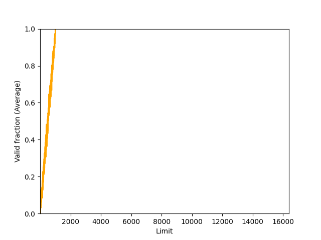

# Chapter 15

2.

930

3.

16284

4.

With 32MB virtual memory space and 1GB physical memory space, the base is 1073741724

5.



# Chapter 16

1.

`./segmentation.py -a 128 -p 512 -b 0 -l 20 -B 512 -L 20 -s 1`

2.

- The highest legal virtual address in segment 0: 19
- The lowest legal virtual address in segment 1: 108
- Segment 0 physical addresses: 0-19
- Segment 1 physical addresses: 492-511
- The lowest illegal physical address: 20
- The highest illegal physical address: 491

`$ ./segmentation.py -a 128 -p 512 -b 0 -l 20 -B 512 -L 20 -s 1 -A 19,108,20,107 -c`

3.

`./segmentation.py -a 16 -p 128 -A 0,1,2,3,4,5,6,7,8,9,10,11,12,13,14,15 --b0 0 --l0 2 --b1 16 --l1 2 -c`

4.

We can set the limit of segment 0(-l) to be 90% of the total memory space size(-a).

5.

We can set `-l 0 -L 0`

# Chapter 17

1.

The memory space gets splitted into pieces.

2.

There're more pieces

3.

Less elements are needed to search for free space

5.

Without coalescing, some requests for large memory will return null and the list is getting bigger.

Yes, sorting by address is better

6.

With too many allocations, the space is not enough to use. Otherwise, all pointers are freed.

7.

```bash
./malloc.py -c -A +10,-0,+20,-1,+30,-2,+40,-3 -p FIRST -l SIZESORT+
./malloc.py -c -A +10,-0,+20,-1,+30,-2,+40,-3 -p FIRST -l SIZESORT+ -C
./malloc.py -c -A +10,-0,+20,-1,+30,-2,+40,-3 -p FIRST -l SIZESORT-
./malloc.py -c -A +10,-0,+20,-1,+30,-2,+40,-3 -p FIRST -l SIZESORT- -C

./malloc.py -c -A +10,-0,+20,-1,+30,-2,+40,-3 -p WORST -l SIZESORT+
./malloc.py -c -A +10,-0,+20,-1,+30,-2,+40,-3 -p WORST -l SIZESORT+ -C
./malloc.py -c -A +10,-0,+20,-1,+30,-2,+40,-3 -p WORST -l SIZESORT-
./malloc.py -c -A +10,-0,+20,-1,+30,-2,+40,-3 -p WORST -l SIZESORT- -C
```
