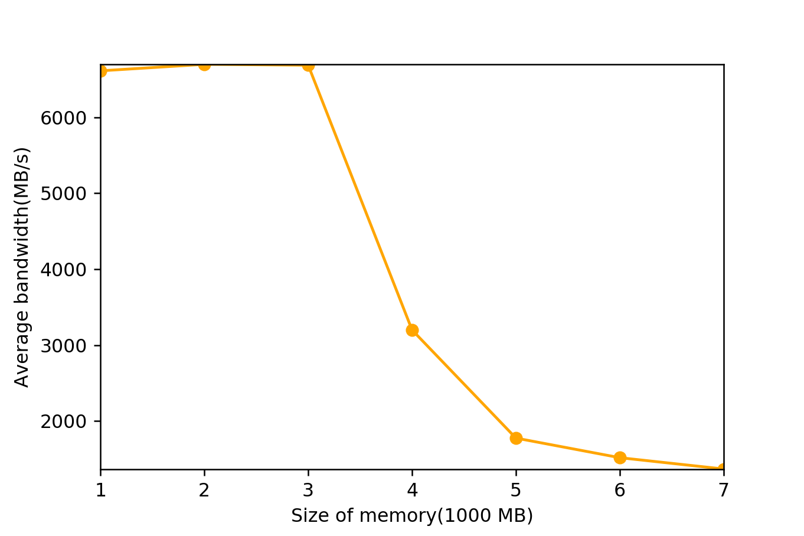
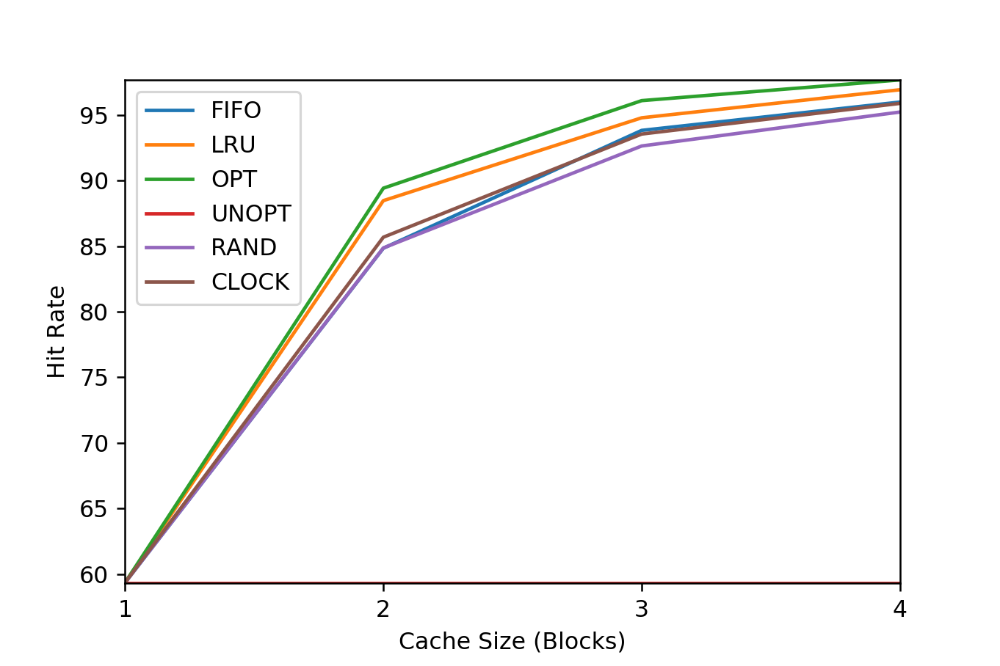

# Chapter 20

1.

We just need the top level page directory base register

2.

We need 2 references to use the multi-level page table and 1 reference to access the physical address, so totally 3 memory references

3.

The page directory fits for temporcal locality while the page table fits for spatial locality

# Chapter 21

1.

The user time increases while idle time decreases. Running multiple instances will increase the user time even more, by a factor of the number of instances

2.

The value of free column increases when the program starts running, and decreases when the program exits

3.

The swapped memory to disk increases in the first loop, then back to zero after

4.

User time increases, and blocks sent to the device also increases

5.

```
allocating 4194304000 bytes (4000.00 MB)
  number of integers in array: 1048576000
loop 0 in 1005.06 ms (bandwidth: 3979.87 MB/s)
loop 1 in 1685.26 ms (bandwidth: 2373.52 MB/s)
loop 2 in 1479.59 ms (bandwidth: 2703.46 MB/s)
loop 3 in 1559.28 ms (bandwidth: 2565.29 MB/s)
loop 4 in 1451.09 ms (bandwidth: 2756.55 MB/s)
loop 5 in 1513.42 ms (bandwidth: 2643.01 MB/s)
loop 6 in 1495.57 ms (bandwidth: 2674.57 MB/s)
loop 7 in 1521.39 ms (bandwidth: 2629.17 MB/s)
loop 8 in 1565.96 ms (bandwidth: 2554.35 MB/s)
loop 9 in 1559.93 ms (bandwidth: 2564.22 MB/s)
loop 10 in 1655.28 ms (bandwidth: 2416.51 MB/s)

allocating 8388608000 bytes (8000.00 MB)
  number of integers in array: 2097152000
loop 0 in 1994.91 ms (bandwidth: 4010.21 MB/s)
loop 1 in 3451.03 ms (bandwidth: 2318.15 MB/s)
loop 2 in 3324.67 ms (bandwidth: 2406.26 MB/s)
loop 3 in 3140.94 ms (bandwidth: 2547.01 MB/s)
loop 4 in 3247.06 ms (bandwidth: 2463.77 MB/s)
loop 5 in 3456.26 ms (bandwidth: 2314.64 MB/s)
loop 6 in 3206.03 ms (bandwidth: 2495.30 MB/s)
loop 7 in 3174.19 ms (bandwidth: 2520.33 MB/s)
loop 8 in 3164.08 ms (bandwidth: 2528.38 MB/s)
loop 9 in 3135.51 ms (bandwidth: 2551.42 MB/s)
loop 10 in 3071.87 ms (bandwidth: 2604.28 MB/s)
```



If memory is sufficient, first loop always appears to be with the best performance. While when memory is not enough, first loop may act worse then subsequent ones.

6.

About 90% of the available memory including swap space

# Chapter 22

1.

```
./paging-policy.py s 0 -n 10 -c

ARG addresses -1
ARG addressfile
ARG numaddrs 10
ARG policy FIFO
ARG clockbits 2
ARG cachesize 3
ARG maxpage 10
ARG seed 0
ARG notrace False

Solving...

Access: 8  MISS FirstIn ->          [8] <- Lastin  Replaced:- [Hits:0 Misses:1]
Access: 7  MISS FirstIn ->       [8, 7] <- Lastin  Replaced:- [Hits:0 Misses:2]
Access: 4  MISS FirstIn ->    [8, 7, 4] <- Lastin  Replaced:- [Hits:0 Misses:3]
Access: 2  MISS FirstIn ->    [7, 4, 2] <- Lastin  Replaced:8 [Hits:0 Misses:4]
Access: 5  MISS FirstIn ->    [4, 2, 5] <- Lastin  Replaced:7 [Hits:0 Misses:5]
Access: 4  HIT  FirstIn ->    [4, 2, 5] <- Lastin  Replaced:- [Hits:1 Misses:5]
Access: 7  MISS FirstIn ->    [2, 5, 7] <- Lastin  Replaced:4 [Hits:1 Misses:6]
Access: 3  MISS FirstIn ->    [5, 7, 3] <- Lastin  Replaced:2 [Hits:1 Misses:7]
Access: 4  MISS FirstIn ->    [7, 3, 4] <- Lastin  Replaced:5 [Hits:1 Misses:8]
Access: 5  MISS FirstIn ->    [3, 4, 5] <- Lastin  Replaced:7 [Hits:1 Misses:9]

FINALSTATS hits 1   misses 9   hitrate 10.00

./paging-policy.py s 0 -n 10 -c --policy=LRU

ARG addresses -1
ARG addressfile
ARG numaddrs 10
ARG policy LRU
ARG clockbits 2
ARG cachesize 3
ARG maxpage 10
ARG seed 0
ARG notrace False

Solving...

Access: 8  MISS LRU ->          [8] <- MRU Replaced:- [Hits:0 Misses:1]
Access: 7  MISS LRU ->       [8, 7] <- MRU Replaced:- [Hits:0 Misses:2]
Access: 4  MISS LRU ->    [8, 7, 4] <- MRU Replaced:- [Hits:0 Misses:3]
Access: 2  MISS LRU ->    [7, 4, 2] <- MRU Replaced:8 [Hits:0 Misses:4]
Access: 5  MISS LRU ->    [4, 2, 5] <- MRU Replaced:7 [Hits:0 Misses:5]
Access: 4  HIT  LRU ->    [2, 5, 4] <- MRU Replaced:- [Hits:1 Misses:5]
Access: 7  MISS LRU ->    [5, 4, 7] <- MRU Replaced:2 [Hits:1 Misses:6]
Access: 3  MISS LRU ->    [4, 7, 3] <- MRU Replaced:5 [Hits:1 Misses:7]
Access: 4  HIT  LRU ->    [7, 3, 4] <- MRU Replaced:- [Hits:2 Misses:7]
Access: 5  MISS LRU ->    [3, 4, 5] <- MRU Replaced:7 [Hits:2 Misses:8]

FINALSTATS hits 2   misses 8   hitrate 20.00

./paging-policy.py s 0 -n 10 -c --policy=OPT

ARG addresses -1
ARG addressfile
ARG numaddrs 10
ARG policy OPT
ARG clockbits 2
ARG cachesize 3
ARG maxpage 10
ARG seed 0
ARG notrace False

Solving...

Access: 8  MISS Left  ->          [8] <- Right Replaced:- [Hits:0 Misses:1]
Access: 7  MISS Left  ->       [8, 7] <- Right Replaced:- [Hits:0 Misses:2]
Access: 4  MISS Left  ->    [8, 7, 4] <- Right Replaced:- [Hits:0 Misses:3]
Access: 2  MISS Left  ->    [7, 4, 2] <- Right Replaced:8 [Hits:0 Misses:4]
Access: 5  MISS Left  ->    [7, 4, 5] <- Right Replaced:2 [Hits:0 Misses:5]
Access: 4  HIT  Left  ->    [7, 4, 5] <- Right Replaced:- [Hits:1 Misses:5]
Access: 7  HIT  Left  ->    [7, 4, 5] <- Right Replaced:- [Hits:2 Misses:5]
Access: 3  MISS Left  ->    [4, 5, 3] <- Right Replaced:7 [Hits:2 Misses:6]
Access: 4  HIT  Left  ->    [4, 5, 3] <- Right Replaced:- [Hits:3 Misses:6]
Access: 5  HIT  Left  ->    [4, 5, 3] <- Right Replaced:- [Hits:4 Misses:6]

FINALSTATS hits 4   misses 6   hitrate 40.00

```

2.

```
./paging-policy.py --addresses=0,1,2,3,4,5,0,1,2,3,4,5 --policy=FIFO --cachesize=5 -c
./paging-policy.py --addresses=0,1,2,3,4,5,0,1,2,3,4,5 --policy=LRU --cachesize=5 -c
./paging-policy.py --addresses=0,1,2,3,4,5,4,5,4,5,4,5 --policy=MRU --cachesize=5 -c
```

We need 1 size bigger to achieve OPT

3.

```
./paging-policy.py -s 0 -n 10 -c
FINALSTATS hits 1   misses 9   hitrate 10.00

./paging-policy.py -s 0 -n 10 -c --policy=LRU
FINALSTATS hits 2   misses 8   hitrate 20.00

./paging-policy.py -s 0 -n 10 -c --policy=OPT
FINALSTATS hits 4   misses 6   hitrate 40.00

./paging-policy.py -s 0 -n 10 -c --policy=UNOPT
FINALSTATS hits 0   misses 10   hitrate 0.00

./paging-policy.py -s 0 -n 10 -c --policy=RAND
FINALSTATS hits 0   misses 10   hitrate 0.00

./paging-policy.py -s 0 -n 10 -c --policy=CLOCK
FINALSTATS hits 1   misses 9   hitrate 10.00
```

4.

```
./paging-policy.py --addresses=1,3,3,3,3,5,7,0,3,3 --policy=LRU -c

FINALSTATS hits 4   misses 6   hitrate 40.00

./paging-policy.py --addresses=1,3,3,3,3,5,7,0,3,3 --policy=RAND -c

FINALSTATS hits 5   misses 5   hitrate 50.00

./paging-policy.py --addresses=1,3,3,3,3,5,7,0,3,3 --policy=CLOCK -c -b 2

FINALSTATS hits 4   misses 6   hitrate 40.00

./paging-policy.py --addresses=1,3,3,3,3,5,7,0,3,3 --policy=CLOCK -c -b 1

FINALSTATS hits 4   misses 6   hitrate 40.00

./paging-policy.py --addresses=1,3,3,3,3,5,7,0,3,3 --policy=CLOCK -c -b 0

FINALSTATS hits 4   misses 6   hitrate 40.00
```

5.


